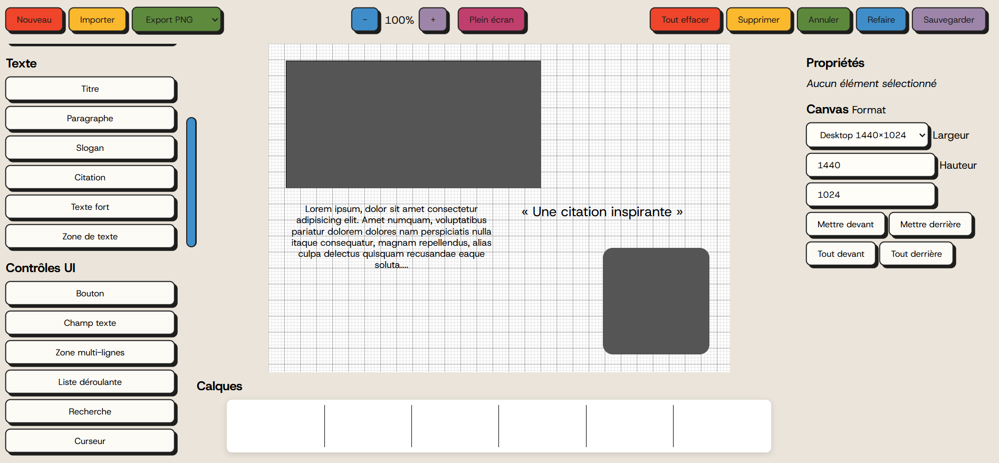

# Léa Buonomo

## À propos de moi

Hello,

Développeuse front-end spécialisée en JavaScript, créatrice d’outils web et passionnée par l’UX, l’accessibilité et les interfaces interactives.

Très curieuse de nature, je m’intéresse à des domaines variés tels que le développement de jeux vidéo et la programmation robotique, la musique assisté par ordinateur (MAO) ou le dessin assisté par ordinateur (DAO).
Ces domaines m’inspirent pour concevoir des expériences créatives et originales.

Actuellement, je recherche une expérience professionnelle et suis très ouverte quant à sa nature :
Un stage, une immersion (PMSMP), une alternance, une collaboration non rémunérée ou même un CDI !

En parallèle de mon apprentissage continu, que je pousse aujourd'hui vers un profil full-stack, je développe des projets pour mes proches et moi-même.
J’ai une soif d’apprentissage, je m’investis à fond, et relever de nouveaux défis est l'une de mes motivations principales !

---

## Compétences clés

- Architecture front-end (organisation, scalabilité, séparation des responsabilités)
- UI engineering (composants réutilisables, interactions avancées)
- Interactions avancées et outils d’édition (drag, resize, sélection)
- JavaScript (ES6+, DOM, fetch API, asynchrone)
- Web Audio / DSP (niveau débutant, WASM & JS)
- Qualité & validation technique (QA, analyse structurelle des interfaces)
- Documentation et Écoconception
- Bootstrap, compréhension des principes des frameworks et bibliothèques
- Intégration responsive et accessibilité (WCAG, Lighthouse)  
- Outils et workflows : Git / GitHub, npm, VS Code  
- Débutante en back-end : Node.js, Express, SQLite, PostgreSQL, Postman, sécurité
- Apprentissage actuel : Projet orienté Web Audio et gestion de données plus complexes

---

## Projets phares

- **Portfolio Léa Buonomo** 

  Portfolio personnel développé en HTML, CSS et JavaScript.
  
  
  
  Déployé sur GitHub Pages : clique sur le badge “Live Demo” ci-dessus pour voir la version en ligne.

- **Outils-Frontend**  

  Carnet d’outils en ligne pour accélérer mes développements front-end.

- **Logiciel de wireframing**
  
  Projet conservé en local
  

---

## Contact

- Portfolio : https://buonomolea.github.io/portfolio-lea-buonomo/
- LinkedIn :  https://www.linkedin.com/in/l%C3%A9a-b-179849208/
- Email : leabuonomo@hotmail.fr

